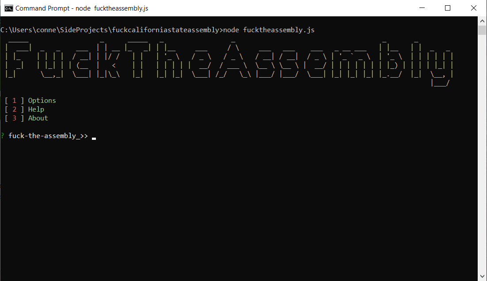
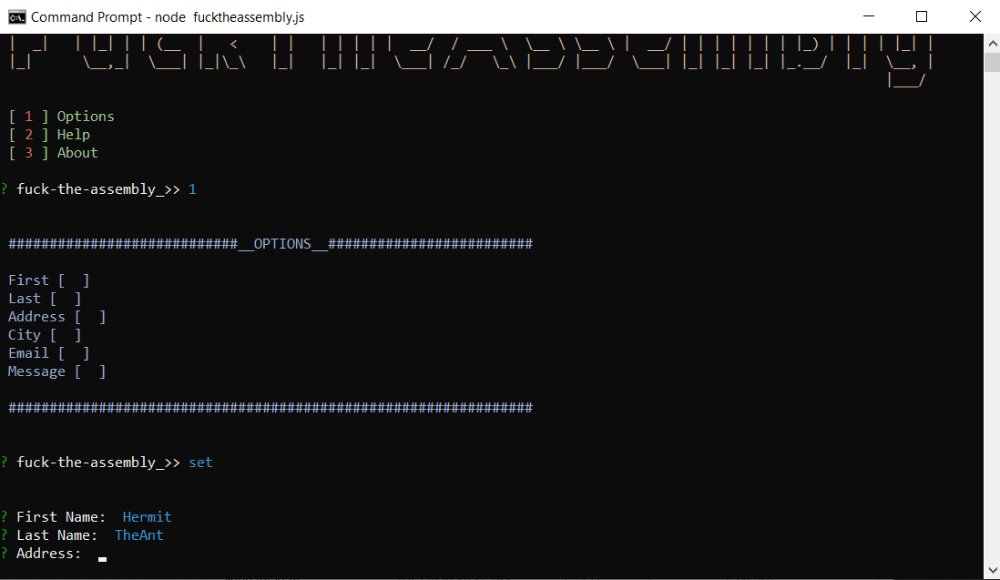
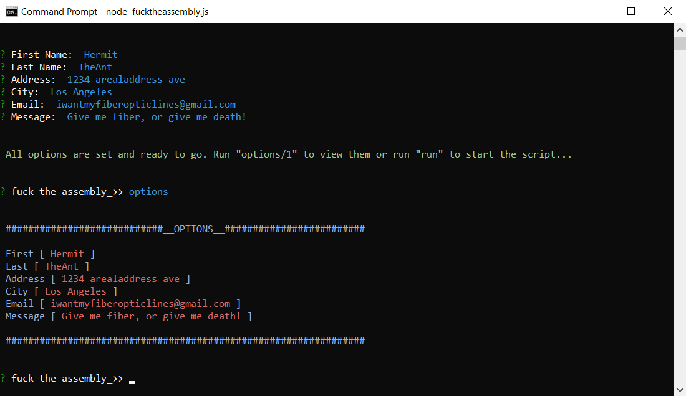

# fuckcaliforniastateassembly
Do you have a gripe with the California State Assembly or one of their members? Then why don't you spam every assembly member with your message in about 3 minutes? This simple Node.js console application allows your to do that exact thing. 

<h2>Installation:</h2>  

<ol>
  <li>If you do not already have <a hrf="https://nodejs.org/en/">Node.js</a> then download it.</li>
  <li>After you have downloaded this repo, open up your Command Line Interface or console and <b><i>cd</i></b> into the folder of this repo that you downloaded</li>
  <li>Once inside the folder run this command <b><i>npm install puppeteer fs chalk figlet inquirer --save</i></b>. This will download all of the node modules needed foe this script. (Because of puppeteer, this download may take a few minutes)</li>
  <li>After node modules are downloaded then you can start the application by running <b><i>node fucktheassembly.js</i></b></li>
</ol>

  

<h2>Screenshots:</h2>  

Startup

Options

Options setup

